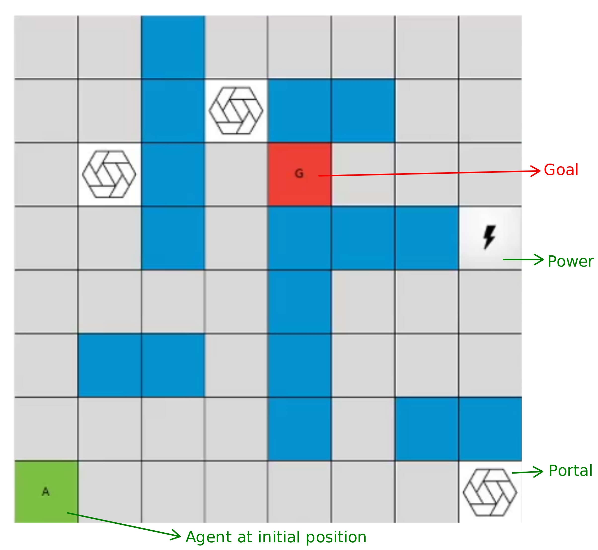
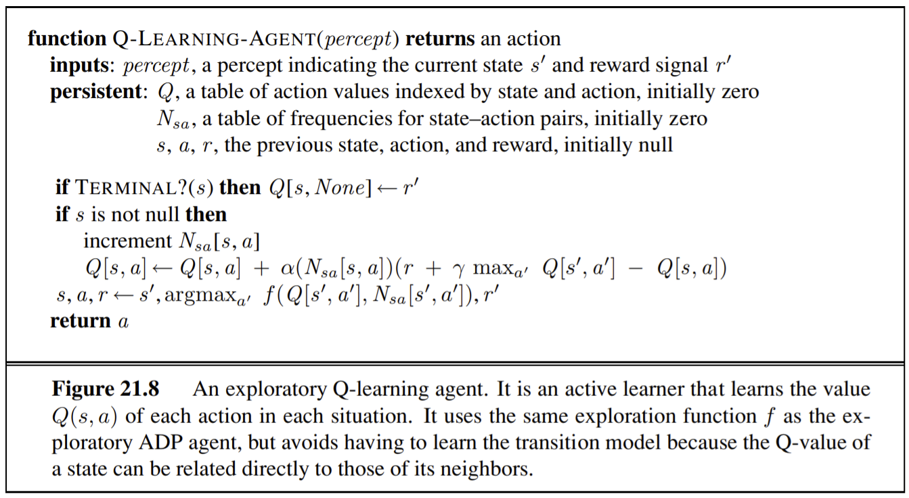
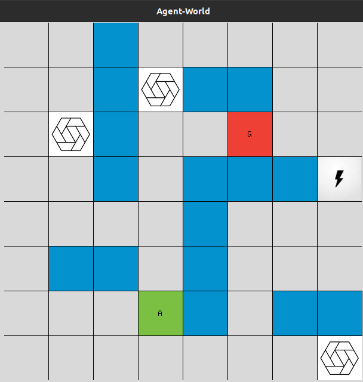
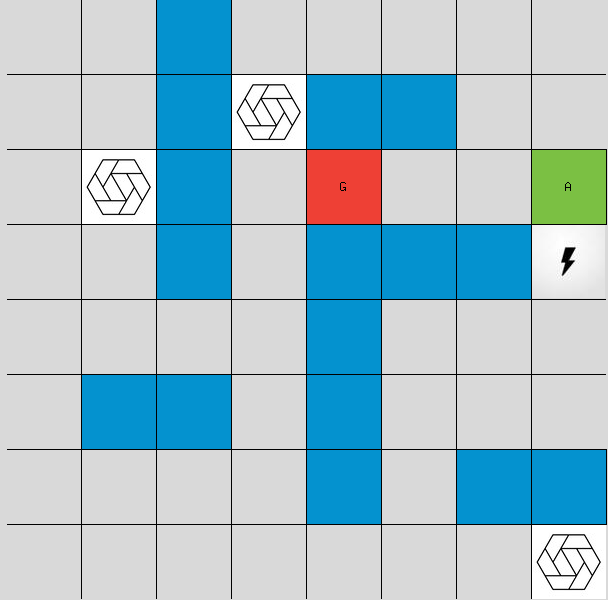
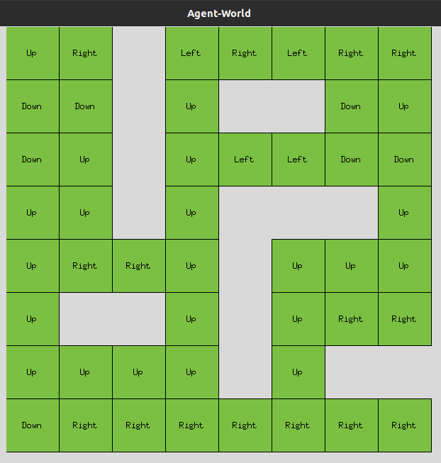

# Reinforcement Learning - Q-Learning Example

### Problem Statement

The agent `A` starts from the initial position and needs to reach the goal `G`. It uses Q-learning to learn the path towards the goal.
However, the goal can be randomly located in any of the cells in top-right quarter of the grid at every episode. The power cell can be reached in one iteration from any of the portals. Otherwise, every step of the agent counts as single iteration.

### Q-learning

In the current setup,
Reward for goal: 100
Reward for non-goal: -0.1
(Can be changed in `_build_rewards` function.)

### Setup
Please clone this repo and run using the following script: \
`pip install -r requirements.txt`
`python src/code.py`

For assignment specific outputs like Path costs, optimal path and knwoledge base, please refer [reports.log](logs/reports.log).  

### Saved Model
A saved model of Knowledge base is available and can be accessed by Turning `LOAD=True` in [code.py](src/code.py)

### Slow Transitions
Please uncomment `self.window.after(DELAY)` on line 223 in [code.py](src/code.py)

Please refer [M20CS064_Report](M20CS064_Report.pdf) for implementation details.

### Results
Snapshots:

Final learnings of the agent after all epochs:

Agent states for specific episodes are printed in the following format:
`[episode 1/500] eps = 0.990 -> iter = 90, rew = 91.1`
where eps is the exploration parameter (the ratio of agent exploring new path instead of going along previous learned path), iter is the number of iterations, rew is the total reward for the current episode. 

### TO DO
* Convert into interactive web-app.
* Please feel free to contribute any other changes.  
  
### References
I have built upon these repositories. 
1. https://github.com/ankonzoid/LearningX/tree/master/classical_RL/gridworld
2. https://github.com/aqeelanwar/Snake-And-Apple
